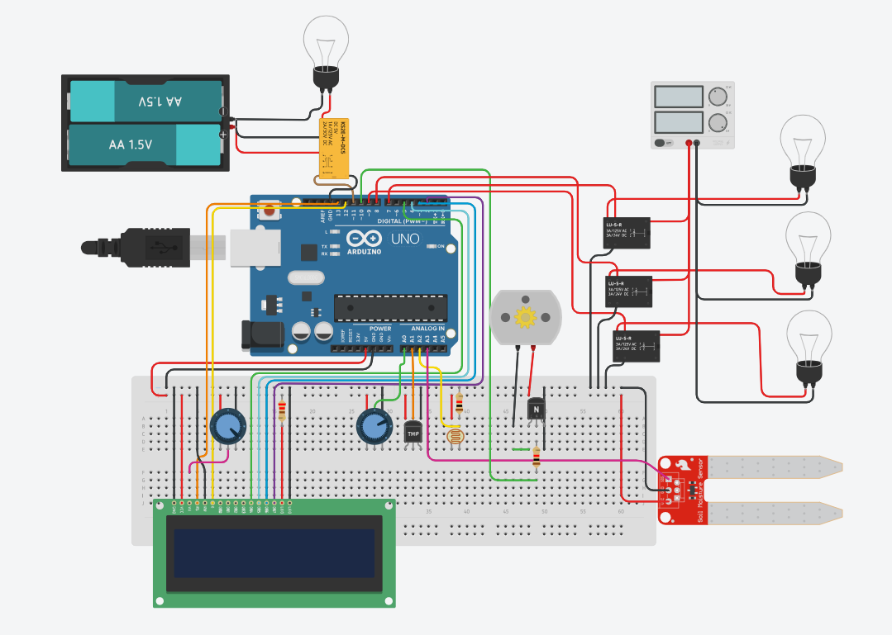

SmartGrow
===========

O SmartGrow é um projeto inovador que combina tecnologia e agricultura para promover a produção de alimentos sustentáveis em áreas urbanas. Esta estrutura vertical inteligente utiliza sistemas avançados de iluminação LED e automação para otimizar o crescimento das plantas.

Visão Geral do Projeto
----------------------

O objetivo do SmartGrow é fornecer uma solução eficiente para a produção de alimentos frescos em ambientes urbanos, reduzindo a dependência de alimentos importados e promovendo a agricultura sustentável. Esta documentação tem como objetivo fornecer informações detalhadas sobre o projeto e orientações para a implementação do SmartGrow em diferentes contextos.

Características Principais
--------------------------

* **Iluminação LED**: Emprega iluminação LED de baixo consumo energético para fornecer a luz necessária às plantas quando houver deficiência da luz solar, garantindo o crescimento saudável em todas as fases.

* **Automação**: Utiliza sensores e um sistema centralizado para monitorar e controlar as condições ambientais, ajustando automaticamente parâmetros como temperatura e umidade para otimizar o crescimento das plantas.
  
* **Uso Eficiente de Espaço**: A estrutura vertical permite aproveitar o espaço disponível em ambientes urbanos, como terraços de prédios, minimizando a pegada ambiental e maximizando a produção de alimentos.

Conteúdo do Repositório
-----------------------

* **[/src](./src)**: Inclui o código-fonte necessário para o funcionamento do sistema de automação da SmartGrow.
  
* **[/images](./images)**: Armazena imagens e ilustrações relacionadas ao projeto.

Requisitos de Instalação
------------------------

Para implementar o SmartGrow, você precisará dos seguintes componentes:

* **Estrutura da torre:** Inclui prateleiras ajustáveis, recipientes para cultivo e sistema de irrigação.  
* **Componentes eletrônicos:**  
Para cada vaso sera necessário

    ##### Sensores
    |Componente|Quantidade|
    |:-----------:|:-----------:|
    Arduino Uno|1
    DHT11|1
    Sensor de Umidade do Solo|1
    Sensor de Luminosidade(LDR)|1

    ##### Atuadores
    |Componente|Quantidade|
    |:-----------:|:-----------:|
    lampada led fotossintetizante|1
    Bomba de Água|1
    mangueira|1
    Modulo Rele|1

Manual de Instalação
--------------------

Para utilizar o SmartGrow, basta conectar o Arduino ao computador e baixar o [código-fonte](./src/codigo_fonte.ino) disponível neste repositório.
Siga as conexões da imagem a baixo:

Esse projeto pode ser encontrado em [Tinkercad](https://www.tinkercad.com/things/4YimeJ5OC37?sharecode=45FaX-erHq77hYURw5Lud0VF2Xva2AGit7TTR04ifFQ)
Apos conectar todos os sensores da forma apropriada, você deve:

1. Conectar o Sensor de Umidade do Solo na terra do vaso
2. Posicionar a lampada led fotossintetizante acima e direcionada a planta
3. Posicionar o sensor de Luminosidade acima da lampada para que sua luz não interfira no sistema
4. Posicionar o sensor DHT11 na base da prateleira
5. Posicione a mangueira no solo
6. Posicione o ventilador na parede da prateleira em direção a saída
7. Posicione o umidificador na prateleira

#### Configurações do codigo:
Para que o sistema funcione adequadamente, é preciso definir alguns parâmetros

```C++
// PARAMETROS:
float umidadeSoloMin = 10; // Defina a taxa minima de umidade do solo em porcentagem

float umidadeAirMin = 10; // Defina a taxa minima de umidade do ar em porcentagem

float tempAirMax = 20; // Defina a Temperatura maxima do ar em graus célcios
float tempAirMin = 5; // Defina a Temperatura minima do ar em graus célcios


long wait = 3 * 1000; // Intervalo entre as informações apresentada no display
```

agora dentro do metodo ```void setup()```

```C++
  /*
  EXEMPLO DE ARRAYS DE TEMPO
  array[0] = Horas
  array[1] = Minutos
  array[2] = Segundos
*/

  // Defina o horário que o sistema esta a iniciar
  TempoSys[0] = 17;
  TempoSys[1] = 59;
  TempoSys[2] = 0;

  // Defina o horário que o sol nasce na região
  TempoNascerSol[0] = 6;
  TempoNascerSol[1] = 0;
  TempoNascerSol[2] = 0;

  // Defina o horário que o sol se poem na região
  TempoPorSol[0] = 18;
  TempoPorSol[1] = 0;
  TempoPorSol[2] = 0;

  // Defina o tempo ideal de luz sobre a planta para seu crescimento
  TempoIdeal[0] = 0;
  TempoIdeal[1] = 2;
  TempoIdeal[2] = 0;
```

Regras do Sistema
--------

* Se a quantidade de tempo ideal de luz não for cumprido até o momento do por do sol, a lampada auxiliar vai ser acionada até completar o tempo
  * A lampada so vai ficar ativa ate o final do dia (00:00/Meia Noite)
* Se a terra estiver abaixo da umidade minima, a bomba de água vai ser ativa
* Se a umidade do ar estiver abaixo do mínimo, o umidificador de ar vai ser ativo
* Se a temperatura do ar estiver acima do máximo, o ventilador vai ser ativo
* Se a temperatura do ar estiver abaixo do mínimo, o aquecedor vai ser ativo

Contribuindo
------------

Se você deseja contribuir para o projeto SmartGrow, sinta-se à vontade para enviar pull requests, relatar problemas ou sugerir melhorias. Sua contribuição é muito bem-vinda!

Licença
-------

O projeto SmartGrow é licenciado sob a [Licença MIT](LICENSE), o que significa que você é livre para usar, modificar e distribuir o projeto, desde que atribua a devida autoria.
